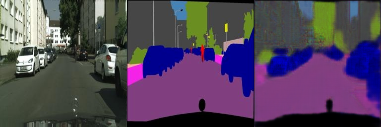
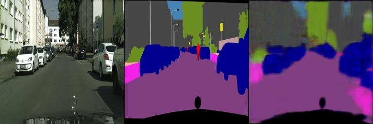
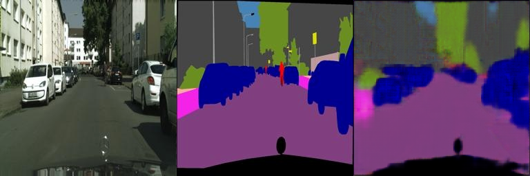
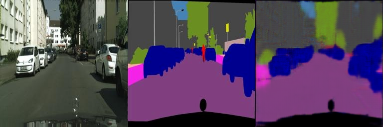
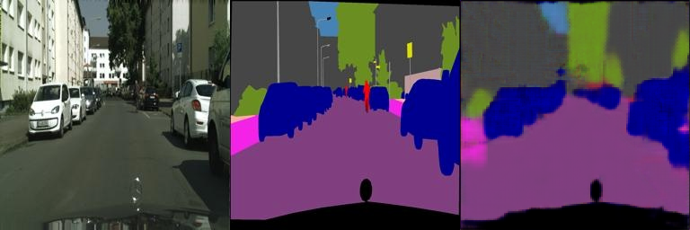

# Implementation of Pix2Pix
deep learning-based DIP (Pix2Pix) with PyTorch
# requirements
To install requirements:
```
python -m pip install -r requirements.txt
```

# Running

prepare dataset
```
bash download_cityscapes_dataset.sh
python cityscapes_datasets.py
```

train
```
python train.py
```

# Results
## Training
citysacpes_dataset 

image_rgb to image_semantic  

UNet

## val loss curve

## image_val during the training epochs
### epoch 50

### epoch 100

### epoch 150

### epoch 200

### epoch 250

### epoch 300

### epoch 400



# edges2shoes dataset, image_val during the training epochs
(Forget to save the train/val loss to txt file during the training epochs)
对于edges2shoes任务，使用的UNet模型较为简单，val_loss降不下来，（难以生成不同的颜色图片）
对于shoes2edges任务，模型容易收敛到局部最优解中（输出完全为白色的图片，图片每一个像素点RGB channel均为255）
## edges2shoes


