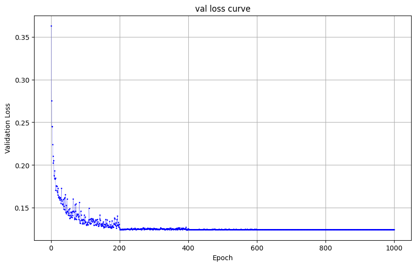

# Implementation of Pix2Pix
deep learning-based DIP (Pix2Pix) with PyTorch
# requirements
To install requirements:
```
python -m pip install -r requirements.txt
```

# Running

```
bash download_cityscapes_dataset.sh
python cityscapes_datasets.py
```

```
python train.py
```

# Results
## Training
citysacpes_dataset     image_rgb to image_semantic    UNet
## val loss curve

## image_val during the training epochs


