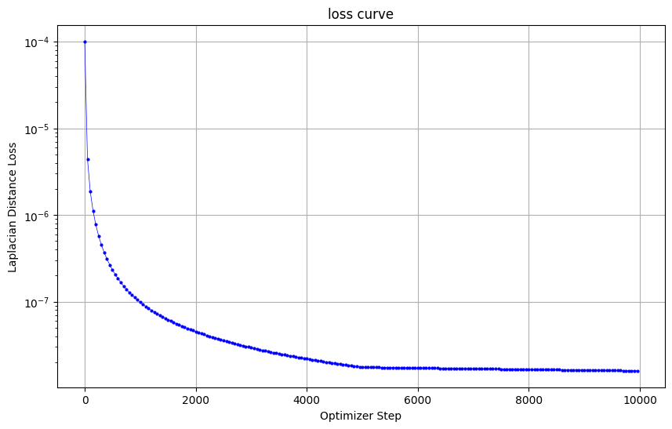
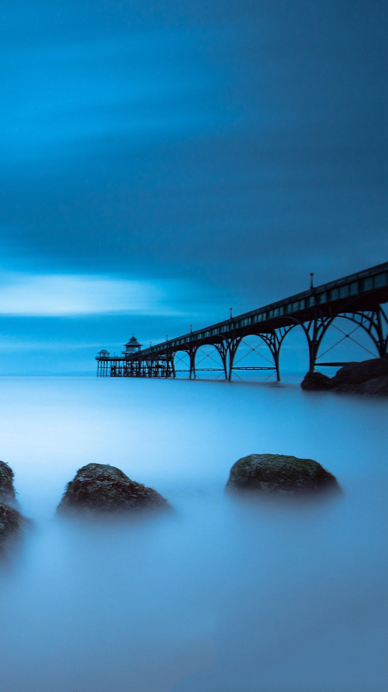
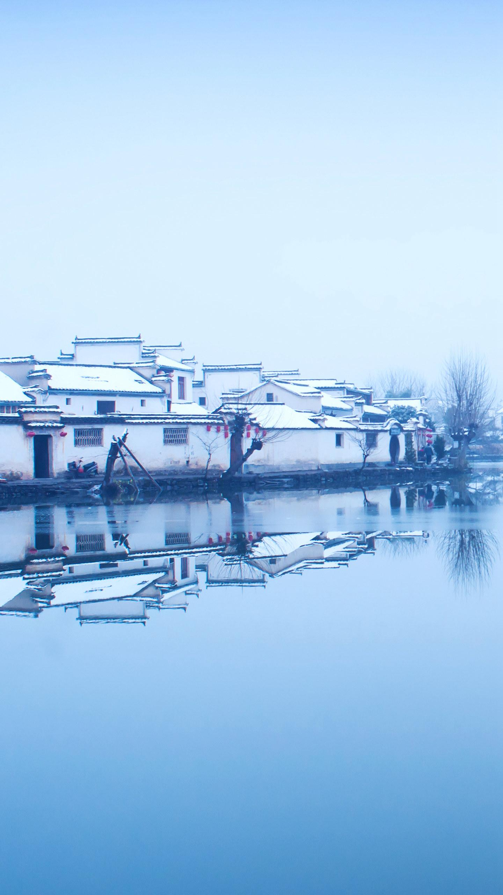
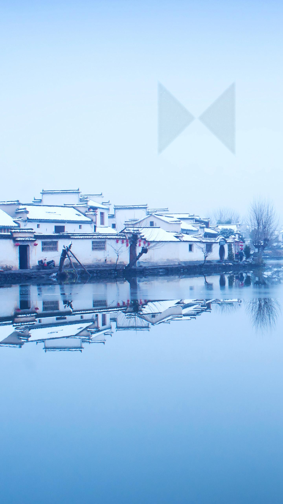
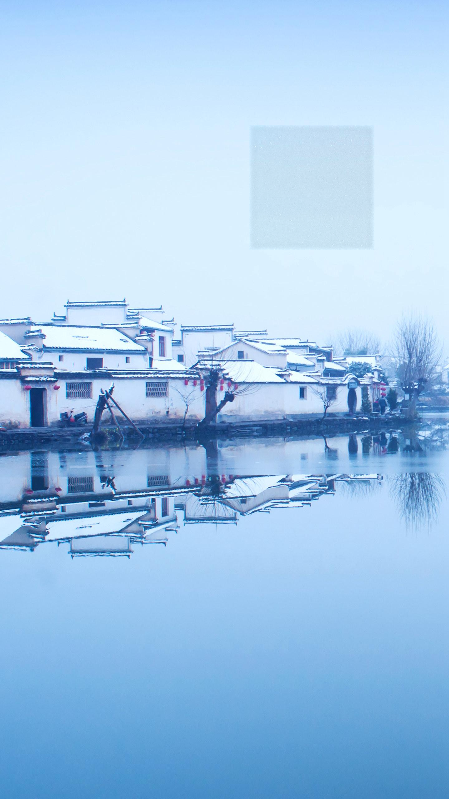

# Implementation of Poission Image Editing
tradition DIP (Poission Image Editing) with PyTorch

# requirements
```
python -m pip install -r requirements.txt
```

# Running
```
python run_blending_gradio.py
```

# Results
```
python run.py
```

```
img_1 = cv2.imread("01.jpg")
img_2 = cv2.imread("02.jpg")

poly_state = np.array([[800, 400],
                       [800, 800],
                       [1200, 400],
                       [1200, 800]])
polygon_state = {'points': poly_state, 'closed': True}

img = blending(img_1, img_2, 0, 0, polygon_state)

cv2.imwrite('image_0.png', img)
```
## loss curve


## foreground image


## background image


## bending
```
poly_state = np.array([[800, 400],
                       [800, 800],
                       [1200, 400],
                       [1200, 800]])
polygon_state = {'points': poly_state, 'closed': True}
```



```
poly_state = np.array([[800, 400],
                       [800, 800],
                       [1200, 800],
                       [1200, 400]])
polygon_state = {'points': poly_state, 'closed': True}
```



