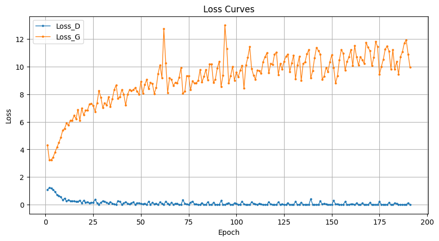
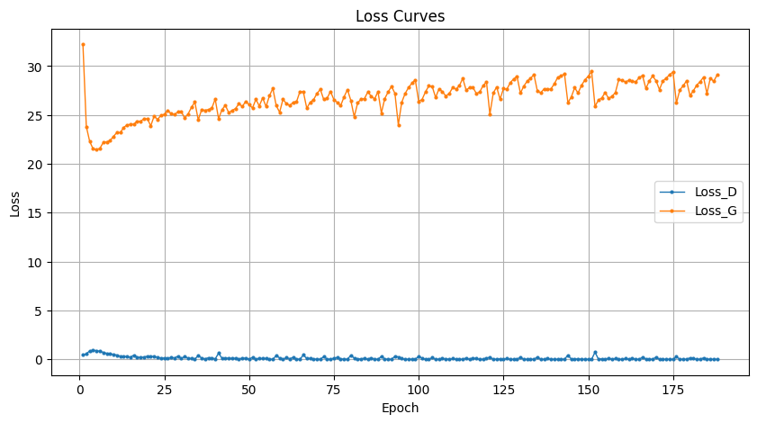

# Implementation of Pix2Pix
conditional GAN-based pix2pix with PyTorch

Generator 与Lab_02中相同的UNet网络结构

Discriminator  Patch GAN


$$L_{cGAN}(G,D) = E_{x,y}[logD(x,y)] + E_{x,z}[log(1-D(x,G(x,z)))]$$
$$G^* = argmin_G max_D L_{cGAN}(G,D)$$


$$L_{L1}(G) = E_{x,y,x}[\left|\left|y-G(x,z)\right|\right|_1]$$


loss_D
```
        optimizer_D.zero_grad()
        disc_real_output = discriminator(annos, imgs)
        d_real_loss = loss_f1(disc_real_output, torch.ones_like(disc_real_output, device=device))
        d_real_loss.backward()

        gen_output = generator(annos)
        disc_fake_output = discriminator(annos, gen_output.detach())
        d_fake_loss = loss_f1(disc_fake_output, torch.zeros_like(disc_fake_output, device=device))
        d_fake_loss.backward()

        disc_loss = d_real_loss + d_fake_loss
        optimizer_D.step()
```

loss_G
```
        optimizer_G.zero_grad()
        disc_gen_output = discriminator(annos, gen_output)
        gen_crossentropy_loss = loss_f1(disc_gen_output, torch.ones_like(disc_gen_output, device=device))
        gen_l1_loss = loss_f2(gen_output, imgs)
        gen_loss = gen_crossentropy_loss + LAMBDA * gen_l1_loss
        gen_loss.backward()
        optimizer_G.step()
```


# requirements
To install requirements:
```
python -m pip install -r requirements.txt
```

# Running
prepare dataset
```
bash download_cityscapes_dataset.sh
python facades_datasets.py
```

train
```
python pix2pix.py
```

# edges2shoes dataset
GAN训练过程中未收敛到预想的纳什均衡（discriminator无法识别出真实图片与generator生成的图片）
仅在训练初期出现预想的生成对抗过程，而后discriminator loss趋于0，generator loss随training epoch的增大而增大
generator生成的图片效果不好
## lambda=10

## lambda=100

